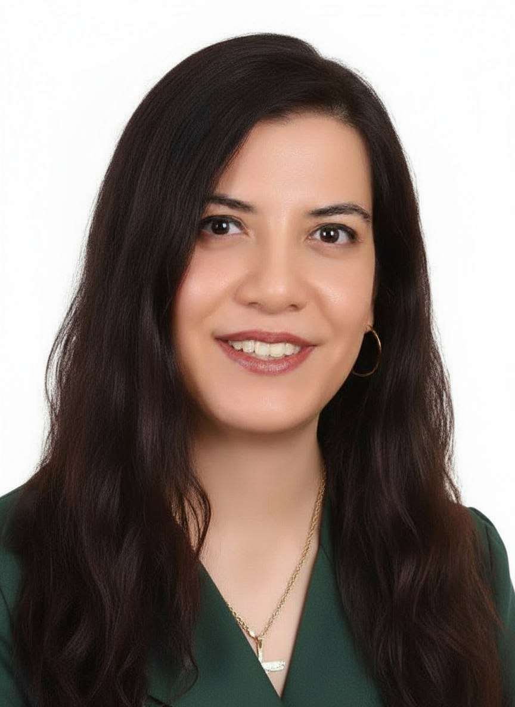

Hi, I'm Farnoush 👋
IT Graduate🎓
Learning Programming & Networking💻
German Teacher 🇩🇪

Skills:
MS Office (Word, Excel, PowerPoint), Windows Operating Systems, Basic Networking (WLAN, Router, TCP/IP), Software Installation & Configuration, First-Level Support & Troubleshooting, Basic Git & GitHub

Goals:
Improve programming skills, Build practical projects
